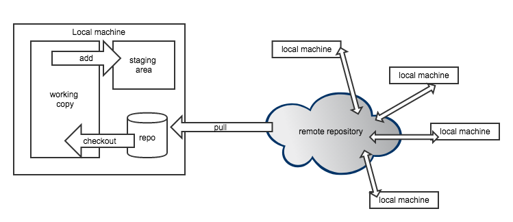
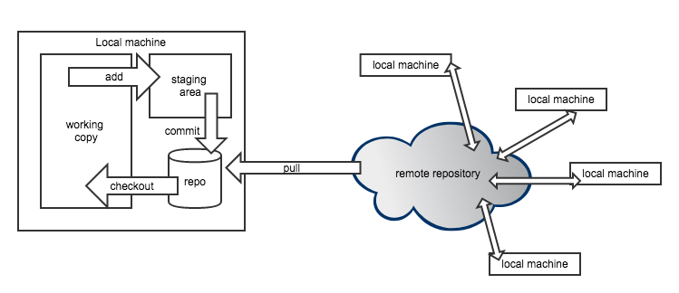

```{r setup, include=FALSE}
options(htmltools.dir.version = FALSE)
load("../data/dplyr_downloads.RData")
load("../data/econ_downloads.RData")
load("../data/teaching_downloads.RData")
library(data.table)
library(tstools)
library(viridis)
library(quanteda)
```

## Outline

- Hacking for Analytics
- Data Management
- Git Version Control 
- Cloud Computing 
- Planning Pt. II 


---

## Background Poll

<iframe src="http://127.0.0.1:1234" border="0px" width="850px" height="500px"></iframe>


---


class: center, middle

## Why Would a Development Economist Want to Program?

---

## Accumulated Monthly Package Downloads by Field

```{r, echo=FALSE, fig.width=12}
econ_total <- econ_downloads[,
                           list(series = "CTV_ECONOMETRICS",
                                value = sum(value)),
                           by = list(date)]
teaching_total <- teaching_downloads[,
                             list(series = "CTV_TEACHING",
                                  value = sum(value)),
                             by = list(date)]

tsl <- c(tstools::long_to_ts(econ_total),
         tstools::long_to_ts(teaching_total),
         tstools::long_to_ts(dp))

tsl <- lapply(tsl, function(x) (x/100000))

tsplot(tsl,
       theme = init_tsplot_theme(line_colors = viridis(3),
                                 lwd = c(2,2,2),
                                 output_wide = TRUE),
       plot_title = 'Total Monthly Downloads (in 100K)',
       plot_subtitle = 'source: cranlogs'
       )


```


---

## Application Programming Interfaces (APIs) for Data Access

```{r, message=FALSE, warning=FALSE, fig.width=12, fig.height = 4}
library(kofdata)
library(tstools)
tsplot(get_time_series("ch.kof.barometer"))
```

<a href="https://datenservice.kof.ethz.ch/api/v1/public/ts?keys=ch.kof.barometer&mime=html">Show Endpoint</a>

---

## Google Natural Language Processing API


---

class: center, middle

## Visualisation: <a href="https://whatsgood.io/post/2019-07-12-favorite-user-take-aways/">What Can I see in Walking Distance from my Office?</a> 

---


## Social Media Visualization

```{r, echo=FALSE, warning=FALSE, message=FALSE}
library(quanteda)
library(quanteda)
library(rtweet)
library(ggplot2)
library(dplyr)

load("../data/tweets.RData")
fcm_plot <- function(tweets, col = "#1F78B4"){
    dfm <- tweets %>%
        filter(lang == "en") %>%
        corpus(text_field = "text") %>%
        tokens(remove_punct = TRUE,
               remove_url = TRUE,
               remove_twitter = TRUE) %>%
        tokens_remove(stopwords("en")) %>%
        dfm()
    toptag <- names(topfeatures(dfm, 20))
    
    
    tag_fcm <- fcm(dfm)
    topgat_fcm <- fcm_select(tag_fcm, pattern = toptag)
    
    textplot_network(topgat_fcm, min_freq = 0.1,
                     edge_alpha = 0.8,
                     edge_size = 5,
                     edge_color = col)
}
```

.pull-left[

### Last 1000 'Inequality' Tweets World Wide
```{r, fig.height = 5, echo=FALSE, warning=FALSE, message=FALSE}
fcm_plot(inequality_ww, col = "#FCFDBFFF")
```

]


.pull-right[
### Last 1000 'Inequality' Tweets Kampala
```{r, fig.height = 5, echo=FALSE, warning=FALSE, message=FALSE}
fcm_plot(inequality)
```
]


---

## Visualisation Libraries & Inspiration

- https://www.r-graph-gallery.com/
- [ggplot2 documentation](https://ggplot2.tidyverse.org/)
- [Apache echarts](https://www.echartsjs.com/examples/en/index.html)
- [Data Driven Documents (D3)](https://d3js.com)
- [Shiny Example Gallery](https://shiny.rstudio.com/gallery/)
- [Seasonal Website](https://www.seasonal.website)

---

## Reproducibility 

> "An article about computational science in a scientific publication is not the
scholarship itself, it is merely advertising of the scholarship. The actual scholarship is the complete software development environment and the complete set of instructions which generated the figures."

<font size="3em">-- Buckheit, J. B., and D. L. Donoho (1995): “WaveLab and Reproducible Research,” In Antoniadis A, Oppenheim G (eds.) Wavelets in Statistics, Lecture Notes in Statistics.</font>

---

class:center,middle

## Code as a Communication Channel

<a href="https://github.com/mbannert/tstools/pull/248"></a>

---

## Why Code ? 

.pull-left[


]

.pull-right[

- APIs 
- Unstructured Data
- Scaling
- Visualisation
- Reproducibilty
- Code As a Communication Channel
 
]

---

## Git Breakdown

- git is NOT github.
- git is NOT dropbox.
- git is a version control system (for text files).
- git is decentralized.

---

.pull-left[

## Git's +

- (+) industry standard (easy to onboard people)
- (+) semantic commits foster real versions
- (+) head is clear (which version counts)
- (+) professional collaboration workflow
- (+) distributed backup

]

.pull-right[

## Git's - 

- (-) learning curve / overhead
- (-) not for binaries

]

---

class: center,middle

## Git Version Control 


---

class: center,middle

## Git Version Control 


---

class: center,middle


## Git Version Control 



---

class: center,middle


## Git Version Control 



---

class: center,middle


## Git Version Control 


---

class: center,middle

## Data Management: Store Data Persistently


---

## Infrastructure


