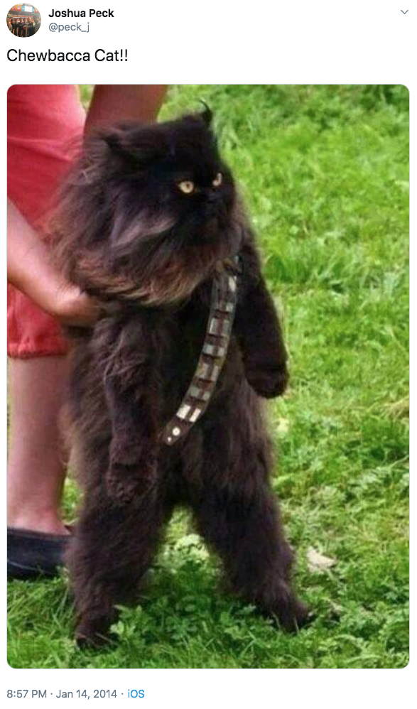
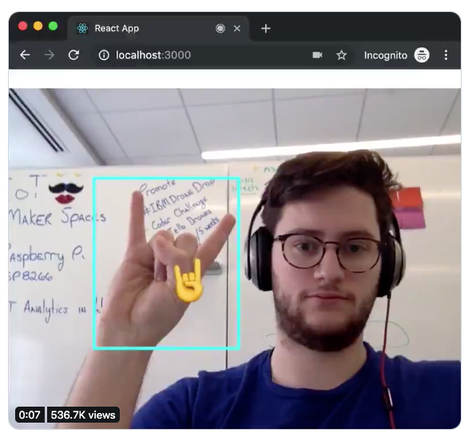
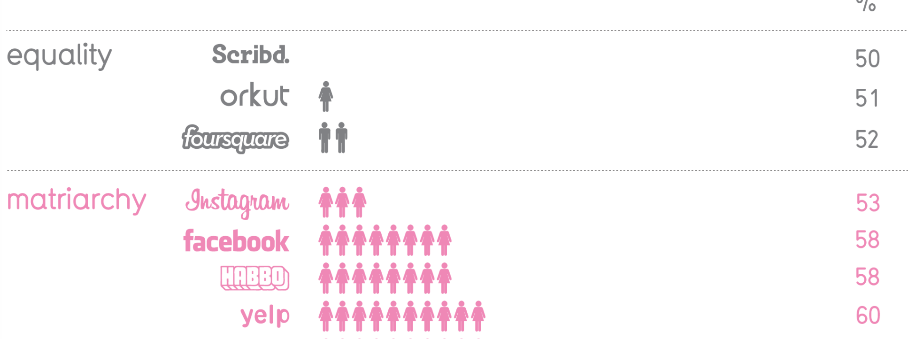
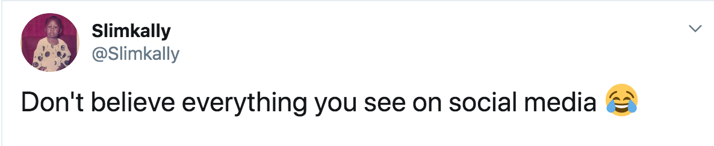

```{r setup, include=FALSE}
options(htmltools.dir.version = FALSE)
```

## Outline

1. Motivation to Code in Research
2. Data Driven Examples (mostly visualization)
3. How to Get Started
4. A DIY example

---

## hacking_data:~$ whoami

### Matthias Bannert ([@whatsgoodio](https://twitter.com/whatsgoodio))

.pull-left[

- IT Lead @KOF, ETH Zurich 
- PhD in Economics 
- 20+ years programming experience
- course material: https://github.com/mbannert/smof
]

.pull-right[


]


---

class: center, middle

## Why Would a Researcher Want to Program? 


---


class: center, middle

## Social Media Data: Feathers or Bricks?

---

class: center, middle

# 700 000 000+ <br>
## number of tweets per day (!)

---

## Images



---

## Twitter: Most Popular Emoji within last 30 sec

<iframe width="800" height="450" src="emoji.html"></iframe>

source: [Oversable HQ Twitter Emoji Race ](https://observablehq.com/@mbostock/twitter-emoji-race)

---

## Emoji Detection /w Tensorflow 

.pull-left[
<a href="https://twitter.com/bourdakos1/status/1125436388026060801"></a>

]


.pull-right[
libraries: 

- [Cloud Annotation](https://github.com/cloud-annotations/training)

- [tensorflow](https://www.tensorflow.org/)

]


---

class: center, middle

## How to Deal With Text, Images and Videos from Millions of Users?

---

## Simulation & Animation

- [Simulated Solutions (Street Traffic)](https://twitter.com/BrentToderian/status/1192568535009988608)

- [All Shots in 2018 NCAA Season](https://twitter.com/CraigTaylorGIS/status/1159779288733880321)

---

## Visualization Examples: Chicks Rule Social Media

<a href="https://informationisbeautiful.net/visualizations/chicks-rule/"></a>


---

class: center, middle

## Turning Text Into Data

---

## Visualization Examples

```{r, fig.height=6, echo=FALSE, message=FALSE, warning=FALSE}
library(quanteda)
library(ggplot2)
library(dplyr)

tokeninfo <- summary(data_corpus_inaugural)

ggplot(data = tokeninfo,
       aes(x = Year, y = Tokens, group = 1)) +
    geom_line() +
    geom_point() +
    scale_x_continuous(labels = c(seq(1789,
                                      2017, 12)), breaks = seq(1789, 2017, 12)) +
  ggtitle("Number of Tokens in Inaugural Speeches of American Presidents") +
    theme_bw()

```

---

## Visualization Examples: Simple Wordcloud

```{r, fig.height=7, fig.width=10, echo=FALSE, message=FALSE, warning=FALSE}
dfm_inaug <- corpus_subset(data_corpus_inaugural, Year <= 1826) %>% 
    dfm(remove = stopwords('english'), remove_punct = TRUE) %>%
    dfm_trim(min_termfreq = 10, verbose = FALSE)

set.seed(100)
textplot_wordcloud(dfm_inaug)
```

---

## Visualization Examples: Wordcloud on Steroids


```{r, fig.height=7, fig.width=10, echo=FALSE, message=FALSE, warning=FALSE}
corpus_subset(data_corpus_inaugural, 
              President %in% c("Washington",
                               "Jefferson", "Madison")) %>%
    dfm(groups = "President", remove = stopwords("english"), remove_punct = TRUE) %>%
    dfm_trim(min_termfreq = 5, verbose = FALSE) %>%
    textplot_wordcloud(comparison = TRUE)

```

---

## Visualization Examples: Cluster Analysis

```{r, fig.height=8, fig.width=11, echo=FALSE, message=FALSE, warning=FALSE}
data_corpus_sotu <- readRDS("data_corpus_sotu.rds")
dfmat_sotu <- dfm(corpus_subset(data_corpus_sotu, Date > as.Date("1980-01-01")),
                  stem = TRUE, remove_punct = TRUE,
                  remove = stopwords("english"))
dfmat_sotu <- dfm_trim(dfmat_sotu, min_termfreq = 5, min_docfreq = 3)

# hierarchical clustering - get distances on normalized dfm
tstat_dist <- textstat_dist(dfm_weight(dfmat_sotu, scheme = "prop"))
# hiarchical clustering the distance object
pres_cluster <- hclust(as.dist(tstat_dist))
# label with document names
pres_cluster$labels <- docnames(dfmat_sotu)
# plot as a dendrogram
plot(pres_cluster, xlab = "", sub = "",
     main = "Euclidean Distance on Normalized Token Frequency")

```

---

## Visualization Examples: Keyness

```{r, fig.height=7, fig.width=11, echo=FALSE, message=FALSE, warning=FALSE}

# Only select speeches by Obama and Trump
pres_corpus <- corpus_subset(data_corpus_inaugural, 
                            President %in% c("Obama", "Trump"))

# Create a dfm grouped by president
pres_dfm <- dfm(pres_corpus, groups = "President", remove = stopwords("english"), 
                remove_punct = TRUE)

# Calculate keyness and determine Trump as target group
result_keyness <- textstat_keyness(pres_dfm, target = "Trump")

# Plot estimated word keyness
textplot_keyness(result_keyness) 
```

    

---

## Why Would a Researcher Want to Program? 


- Access to Data Sources (**A**pplication **P**rogramming **I**nterfaces) 


---


## Why Would a Researcher Want to Program? 


- Access to Data Sources (**A**pplication **P**rogramming **I**nterfaces) 

- Visualization


---


## Why Would a Researcher Want to Program? 


- Access to Data Sources (**A**pplication **P**rogramming **I**nterfaces) 

- Visualization

- Text Mining & Regular Expressions

---

## Why Would a Researcher Want to Program? 


- Access to Data Sources (**A**pplication **P**rogramming **I**nterfaces) 

- Visualization

- Text Mining & Regular Expressions

- Reproducibility


---


## Why Would a Researcher Want to Program? 


- Access to Data Sources (**A**pplication **P**rogramming **I**nterfaces) 

- Visualization

- Text Mining & Regular Expressions

- Reproducibility

- Code as Communication Channel

- ...


---


class: center, middle

## Where to Start ?


---


## Most Popular Scripting Languages in Data Science

.pull-left[


- [R Language for Statistical Computing](https://r-project.org)
- [Stackoverflow questions](https://stackoverflow.com/questions/tagged/r): 300K+
- Recommended Editor: [R Studio IDE](https://rstudio.com/products/rstudio/)
- Extensions
  - [CRAN](https://cran.r-project.org/) Repository /w ~15K Extension packages
  - [Shiny Web Framework](http://shiny.rstudio.com/)
- Trend: from Domain Specific to General Purpose
- Biggest Conference: useR! 

]

.pull-right[


- Python [2](https://www.python.org/downloads/release/python-272/) & [3](https://www.python.org/)
- [Stackoverflow questions](https://stackoverflow.com/questions/tagged/python): ~1.3M+
- Recommended Editor: [Visual Studio Code /w Jupyter Notebooks](https://code.visualstudio.com/docs/python/jupyter-support)
- Extensions
  - [anaconda](https://www.anaconda.com/)
  - [pandas](https://pandas.pydata.org/)
  - [numpy](https://numpy.org/)
  - [sciPy](https://www.scipy.org/)
- Most Popular Language in Deep Learning and Machine Learning
- Trend: General Purpose /w Scientific Extensions

]

---

## A Do-It-Yourself Example: Text Mining Twitter

1. Understand How to Get Data
2. Understand How to Turn Text into Data
3. Run Code https://github.com/mbannert/smof/tweets_demo.R

---

    
## Don't Believe Everything You See on Social Media
    
<a href="https://twitter.com/Slimkally/status/1188828753834790912?s=20"></a>
    


