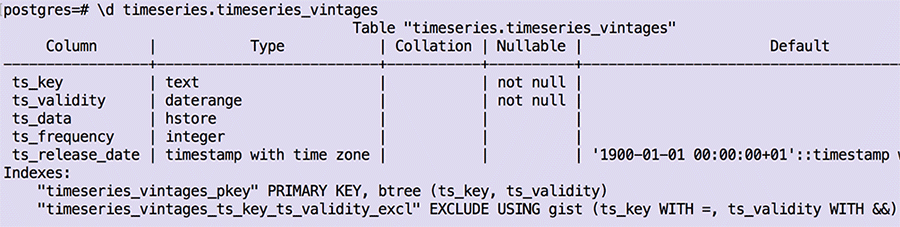

<!-- 
framework to map R ts objects to PostgreSQL KVP + relations.
talk's not only about the timeseriesdb approach does it, but

-->


```{r setup, include=FALSE}
options(htmltools.dir.version = FALSE)
```

---

class: center, middle


---

class: center, middle

### Why ?

---

class: center, middle

### 1. Long Lived Data Pipelines

---

## Issues /w File Based Management of Time Series


- (-) keys may be redundant across files
- (-) lack of reasonable conventions for file naming

=> constraints are hard to implement

---

## timeseriesdb: Store Time Series

```{r, eval=FALSE, echo=TRUE}
library(timeseriesdb)

con <- createConObj("mbannert",
                    "postgres",
                    "localhost",
                    passwd = "")

lots <- list(ts1 = ts(rnorm(100), start = c(1990,1), freq = 4),
             ts2 = ts(rnorm(135), start = c(1994,3), freq = 12)

storeTimeSeries(con, lots)
```

- list of time series
- unique identifiers = list names


---

## timeseriesdb: Read Time Series

```{r, message=FALSE, warning=FALSE}
library(timeseriesdb)

con <- createConObj("mbannert",
                    "postgres",
                    "localhost",
                    passwd = "")

# returns a list, in order to keep class of output the same. 
tsl <- readTimeSeries(con,"ch.kof.barometer")
names(tsl)
class(tsl)
class(tsl$ch.kof.barometer)
```

---

## timeseriesdb: reading multiple series

--
```{r}
# key vectors
tsl <- readTimeSeries(con,
                      c("ch.kof.barometer",
                        "ch.kof.mpc"))
```
--

```{r}
# by regular expression
cpi <- readTimeSeries(con,"ch.fso.cpi", regex = T)
```

--
```{r}
# by stored sets
keys <- readTsSetKeys(con, "kof_indicators")$ts_key
set_of_ts <- readTimeSeries(con, keys)
names(set_of_ts)
```


---

### Access Beyond R: REST API


--

```{r, message=FALSE, warning=FALSE, fig.height=4}
library(kofdata)
library(tstools)
tsplot(get_time_series("ch.kof.barometer"))

```


---

### 2. Comprehensive, Multi-Lingual Meta Information


---

### 2. Comprehensive, Multi-Lingual Meta Information

```{r}
mi.en <- readMetaInformation(con,
                    c("ch.kof.inu.ng08.fx.q_ql_ass_bs.balance"),
                             locale = "en")
en <- mi.en[[1]][!grepl("unlocal",names(mi.en[[1]]))]
tail(en, 5)


```
---

### 2. Comprehensive, Multi-Lingual Meta Information

```{r}
mi.fr <- readMetaInformation(con,
                    c("ch.kof.inu.ng08.fx.q_ql_ass_bs.balance"),
                             locale = "fr")
fr <- mi.fr[[1]][!grepl("unlocal",names(mi.fr[[1]]))]
tail(fr, 5)


```


---

class: center, middle

### 3. Revision Handling

> "I've found the best way to revise your own work is to pretend
> that somebody else wrote it and then to rip the living s*** out 
> of it."

> `r tufte::quote_footer('--- Don Roff, writer')`


---

### 3. Revision Handling

```{r}
readTimeSeries(con, "ch.snb.lb.aus",
               valid_on = "2015-04-23")
```

--
```{r}
readTimeSeries(con, "ch.snb.lb.aus",
               valid_on = "2015-07-23")
```


---

### 3. Revision Handling: All

```{r, echo=TRUE, eval=FALSE}
readAllVintages(con, "ch.snb.lb.aus")
```


---

### Under the Hood: Relations (tables)


---

### Under the Hood: Data Types



--

- hstore key value pair reduces number of records
- validity is a range NOT a date
- validity and indices implement non-overlapping constraint


---

### Under the Hood: Key Value Pairs (hstore)


---

## Summary

--

### 1. Long Term Data Conservation ⏳⏳⏳

--

### 2. Comprehensive Meta Descriptions 🇫🇷🇨🇭🇺🇸🇮🇹🇧🇷

--

### 3. Manage Revisions 🗄


---

### Outlook

- plumbr based REST API 😴 
- Row Level Security based access management (time series level) 🚣🔐
- explore big data 🔎💾💾💾💾💾💾💾💾💾💾💾💾💾


### Feedback?

 @whatsgoodio

 https://github.com/mbannert/timeseriesdb


