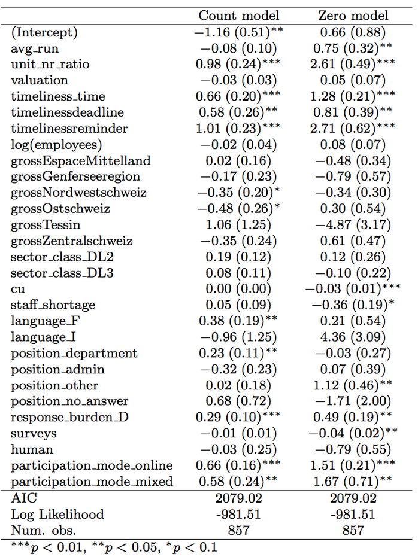

## Levels of Information: Summary Statistics
This example is missing because you decide not to use shiny for interactive documents.


## Levels of Information: Statistical Inference


## Levels of Information: Micro Level Visualization


## Analysis and Visualization
**Tools**

- programs: STATA, SPSS, Gauss etc. 
- scripting languages with scientific computing libraries: R, Python, MATLAB, Octave, Julia ...
- Web frameworks (mostly based on javascript): D3, Highcharts, crossfilterJS

**Starting Point**

- ideal case: one-observation-per-row formats, e.g. data.frame, data.table, .csv, spread sheet
- possible deviation: nested data, observations of unequal length ...

## Hands-On Example: Mouse Tracking c'd
Micro level visualization
```{r}
# Remember the processing...
library(rjson)
json_list <- rjson::fromJSON(file = "application/coords.json")
coord_df <- data.frame(X = unlist(lapply(json_list,"[[","X")),
                       Y = unlist(lapply(json_list,"[[","Y"))
)
# Remember the resulting data.frame from 
# a single user
head(coord_df)
```

## Show Mouse Path: Source Code
```{r,eval=FALSE}
library(png) # write pngs
library(EBImage) # from bioconductor for readImage 
library(gridExtra) # extra stuff for coordinates
library(ggplot2) # 'grammar of graphics'

# choose background picture
img.path <- "application/blue.png" # read the square
img <- readImage(img.path) # needs library(EBImage)
grid.newpage()
gob <- ebimageGrob(img, raster=TRUE) # needs library(gridExtra)

# adjust position to screen!!
p <- ggplot(coord_df) +
  annotation_custom(gob, xmin=436, xmax=685,ymin=-220,ymax=-420) +
  geom_point(aes(X,Y))  + 
  scale_y_reverse() # this line is important because 0 is top left!!
  # don't use geom_line here, because it has another order!!!
  geom_path(aes(X,Y))
p
```

## Show Mouse Path
Remember: In web programming 0,0 is the **top left** corner
```{r,echo=FALSE,message=FALSE,warning=FALSE}
# load libraries for raster Images
library(png)
library(ggplot2)
library(EBImage) # from bioconductor for readImage 
library(gridExtra)

# choose background picture
img.path <- "application/blue.png" # from CRAN
img <- readImage(img.path) # needs library(EBImage)
grid.newpage()
gob <- ebimageGrob(img, raster=TRUE) # needs library(gridExtra)

```

```{r,echo=FALSE,message=FALSE}
p <- ggplot(coord_df) +
  annotation_custom(gob, xmin=436, xmax=636,ymin=-220,ymax=-420) +
  geom_point(aes(X,Y))  + 
  coord_fixed(ratio = 1) +
  scale_y_reverse() +
  # don't use geom_line here, because it has another order!!!
  geom_path(aes(X,Y))
p

```

## Visualization using a JS Framework
Example: Number of returned questionnaires per day, random data.

**Calendar Chart**

- Data Driven Documents (D3) **!!needs a local web server**
- JSON (modified using R)
- light weight github project build based on D3

http://kamisama.github.io/cal-heatmap/v2/

[View Example](http://localhost:1234/calendar2.html)

## R's API communication in Action: Visualizing Geo Locations 
What the following example does:

- Find out IP address using an API (**a**pplication **p**rogramming **i**nterface)
- Find out longitude and latitude using a free geoip service
- Read a raster image of Europe using google's API
- Use the ggplot R package to position the current location on the map

Tools: R, google API, telize.com REST API free geoip service

[View Example](http://localhost:1234/../findip.html)


## Thanks. See You in the Lab Sessions!
<div class="columns-2">


Questions & Feedback

- http://kof.ethz.ch/en/about-us/people/matthias-bannert/
- bannert@kof.ethz.ch
- https://github.com/mbannert


