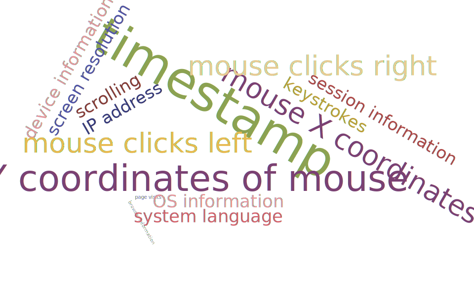
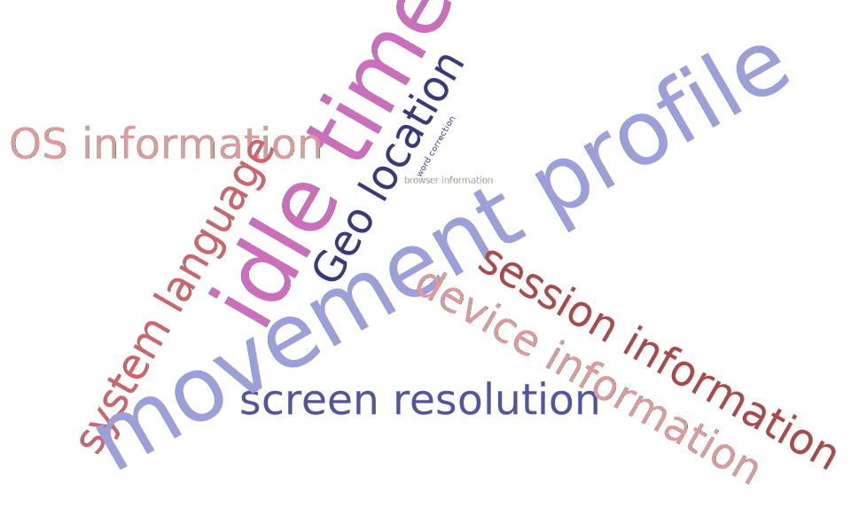
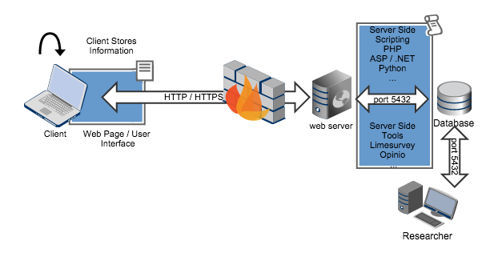

## Overview

- Personal Background + Work
- Collecting Information
- Pioneering Work
- Hands-on Example: Mouse Tracker
- AJAX


## About KOF, About Me
<div class="columns-2">

  **KOF Swiss Economic Institute**
  
  - Conducts Regular Business Tendency Surveys
  in multiple sectors since the 70s
  - Surveys more than 10'000 companies
  - Online and paper based surveys
  
  
  **Personal**
  
  - From Web Development to Econometrics and Statistics
  - Research Interests: Response Behavior, Data Processing
  - From PHP, HTML, CSS, JS AND SQL to R and SQL 
  

</div>

## Latest Work
<style>
.smallfont {
   font-size: .6em;
   line-height: .3em;
}
</style>

<div class="columns-2">


Summary
 
- Matches Data from Survey About Survey with Regular BTS
- Classical Server Side Paradata
- Perceived Response Burden and Panelists' Track Record drive Unit NR

<dive class="smallfont">
Bannert, M. and A. Dibiasi (2014): Unveiling Participant Level Determinants of Unit Non-Response in Business Tendency Surveys, KOF Working Papers No. 363, July, Zurich
</div>

</div>

## Available Information (What We Can Collect)


## Learning From Information


## Collecting Information
<style>
.smallfont, columns-2 {
   font-size: .6em;
   line-height: .3em;
}
</style>


<div class="smallfont">source: own gliffy! illustration</div>
<br />
<div class="columns-2">
Client Side Paradata

- Recording without Interaction with Server

Server Side Paradata

- Only records Interaction with Server itself

</div>

## What Runs Server Side 
<div class = "columns-2">
Scripting languages

    - Python
    - PHP
    - ASP
    - .NET
    - JSP
    - ...


Web servers 

    - Apache
    - Apache Tomcat
    - nginx
    - NodeJS
    - ...
</div>


## Pioneering Work
<style>
.smallfont{
   font-size: .6em;
   
}
</style>

- Client Side Paradata: User Action Tracer
- Server Side Paradata: Scientific Log File Analyzer

Reips, U.-D., & Stieger, S. (2004). Scientific
LogAnalyzer: A Web-based tool for analyses of
server log files in psychological research.
Behavior Research Methods, Instruments, &
Computers, 36, 304-311

Stieger, S., & Reips, U.-D. (2010). What are
participants doing while filling in an online
questionnaire: A paradata collection tool and an
empirical study. Computers in Human Behavior,

**=>** The web is moving fast: Frameworks have changed implementations substantially, but ideas and findings still very inspiring!

## User Action Tracer Image Output 


## The User Action Tracer Output String


## String Processing - Regular Expressions
An R Example
```{r}
# UAT Tool Example output
rec <- "lXNtoilre7_2|M677|13|1320|M160|101|1750"
split1 <- unlist(strsplit(rec,"M"))
user <- split1[1] # should replace | with "" here (gsub)
user
```

```{r}
moves <- strsplit(split1[-1],"\\|")
moves <- lapply(moves,as.numeric)
l <- lapply(moves,'names<-',c("X","Y","time"))
do.call("rbind",l)

```

## Client Side - Ingredients For A Hands-On Example
Mouse Tracker that records mouse movement and reports coordinates
in a standardized output format. 

- simple single Page HTML Website (prettified with bootstrap)
- Javascript / jQuery Framework
- standardized exchange format: JSON
- Scientific Computing Environment: R (r-project.org)

## The HTML Page
```
<!-- HTML: presentation, CSS: prettify, JS: Interaction -->
<html>
<head>
<!-- Include CSS style sheets here --> 
</head>

<body>
  <!-- Place some content here. --> 
</body>

<script src="http://code.jquery.com/jquery-1.10.2.js"></script>
<script>
  /* Place tracking scripts at the end to make sure
  everything is loaded. */
</script>
</html>
```


## The jQuery Framework
> jQuery is a fast, small, and feature-rich JavaScript library. It makes things like HTML document traversal and manipulation, event handling, animation, and Ajax much simpler with an easy-to-use API that works across a multitude of browsers. With a combination of versatility and extensibility, jQuery has changed the way that millions of people write JavaScript.

> -- <cite>jQuery.com, What is jQuery?</cite>

```
$(".jumbotron").mousemove(function(e) {
    coordX = e.pageX;
    coordY = e.pageY;

    $("#coords").text("X: " + coordX + ", Y: " + coordY);

    recordCoords();
});
```

## JSON
- **J**ava**S**cript**O**bject**N**otation
- light weight standard, alternative to XML
- allows for nested data structure
- no regular expression string parsing necessary in analytical languages

**JSON Example**
```
[{"X":495,"Y":349},{"X":501,"Y":344},{"X":505,"Y":341}]
```


## The R Language
- R is a language and environment for statistical computing and graphics
- Offers a lot of general purpose features compared to the likes of SPSS
- 5867 packages extend R making it the largest open source library for scientific computing from Computational Physics to Web Technologies (see [CTV](http://cran.r-project.org/web/views/))

```{r,eval = FALSE}
library(rjson)
json_list <- rjson::fromJSON(file = "application/coords.json")
coord_df <- data.frame(X = unlist(lapply(json_list,"[[","X")),
                       Y = unlist(lapply(json_list,"[[","Y"))
)
head(coord_df)
```
<div class="columns-2">
```{r,echo=FALSE}
library(rjson)
json_list <- rjson::fromJSON(file = "application/coords.json")
coord_df <- data.frame(X = unlist(lapply(json_list,"[[","X")),
                       Y = unlist(lapply(json_list,"[[","Y"))
)
head(coord_df,2)
```

[Visit Example Page](application/simple.html)

</div>


## Sandbox Summary
1. HTML page starts to record mouse movement when mouse is within 'jumbotron'
2. Mouse movement is recorded in a javascript array of key value pairs.
3. Hit 'success' transforms array to **JSON** string and pastes it to text area.

Note: In a real world setup the JSON string has to be send to the webserver!

## A Short Take on AJAX
<style>
.smallfont {
   font-size: .6em;
   line-height: .3em;
}
</style>

- AJAX: **A**synchronous **J**avascript **A**nd **X**ML
- General Use case: Updating the website without reloading the entire page
- Well established standard, supported by many frameworks e.g. **jQuery**
- Our use case: Recording mouse movement and processing it into a JSON string
before sending it to the server

```
$( "#send2server" ).click(function() {

$.ajax({
    type: "POST",
        url: "test.py",
        data: JSON.stringify($dict)
    });	

});
```
<div class = "smallfont">**Note**: In the Hands-On-Example we will do the data transfer 'manually'.</div>


## Online Resources
- [Javascript 101](http://learn.jquery.com/javascript-101/)
- [jQuery Framework](http://jquery.com)
- [Bootstrap Framework](http://getbootstrap.com)
- [R Project for Statistical Computing](http://r-project.org)
- [Stackoverflow Programming Q&A](http://www.stackoverflow.com)
- [W3C Schools HTML](http://www.w3schools.com/html/default.asp)


