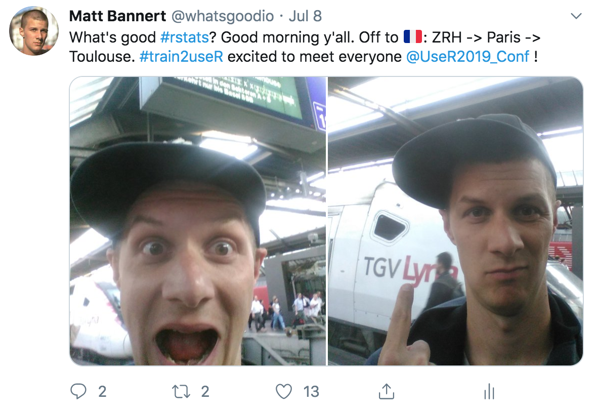

class: center, middle


```{r setup, include=FALSE}
options(htmltools.dir.version = FALSE)
```
---

## #train2useR!




---

## #train2useR!

<iframe width="900" height="500" src="trainride.html" frameborder="0" ></iframe>

---

class: middle, center

## #train2useR!


---


## #bus2useR!


---


class: center, middle


---


class: center, middle

```{r, echo = FALSE, message=FALSE, warning=FALSE}
library(ggplot2)
d <- data.frame(variable = c("cp","tp"),
                value = c(913, 265),
                class = c("total","total"),
                stringsAsFactors = FALSE)
gg <- ggplot(d, aes(class))

gg + 
  geom_col(aes(fill = variable, y = value), width = 0.1,
           fill = c("#FDE725", "#440D54")) +
  coord_flip() +
  theme_minimal() +
  theme(legend.position = "none",
        axis.title.x = element_blank(),
        axis.text.x = element_blank(),
        axis.ticks.x = element_blank(),
        axis.title.y = element_blank(),
        axis.text.y = element_blank(),
        axis.ticks.y = element_blank(),
        panel.grid.major = element_blank(),
        panel.grid.minor = element_blank()
        )
```

918 participants in 18 tutorials.

---

## Hacking R Studio


.pull-left[
<a href="https://twitter.com/whatsgoodio/status/1148533934776639489"></a>
]


.pull-right[

]

---

class: middle, center


---

## Lightning Talks


---

## Colin Gillespie on R and Security   

.pull-left[
<iframe width="560" height="315" src="https://www.youtube.com/embed/5odJxZj9LE4?start=26" frameborder="0" allow="accelerometer; autoplay; encrypted-media; gyroscope; picture-in-picture" allowfullscreen></iframe>
]

.pull-right[

]

---

class: center, middle

## 151 talks 
## 71 lightning talks
## 94 posters


---


class: center, middle

## 184 students 
## 331 academics
## 509 participants from the industry

---

class: center, middle

```{r, echo=FALSE, message=FALSE, warning=FALSE, fig.width=12}
library(ggplot2)
library(dplyr)
countries <- read.csv2("data/countries.csv", sep="," ) %>% 
  arrange(desc(participants))

gg <- ggplot(data = countries,
             aes(x = reorder(country,participants),
                 y = participants,
                 fill = Europe)
             )
gg + 
  geom_bar(stat = "identity") +
  theme_minimal() +
  theme(axis.title.y=element_blank(),
        panel.grid.major.y = element_blank()) +
  coord_flip() + 
  scale_fill_manual(values=c("#FDE725", "#440D54"))

```


---

class: center, middle


---


## Resources I

### Tutorials: 

[Official Page](http://www.user2019.fr/tutorials/)

[Colin Fay's Workshop](https://github.com/ColinFay/user2019workshop)

[Dirk Eddelbuettel's Workshop](http://www.user2019.fr/static/pres/tutoam4.pdf)

### Talks

[Colin Gillespie's on Security](https://youtu.be/5odJxZj9LE4)

[Achim Zeileis' on colorspace](https://youtu.be/6bv2IAcNE_c)

[Julia's Keynote (begins @46:40)](https://youtu.be/Z8PqwFPqn6Y?t=2805)

[Data Science in a Box](https://datasciencebox.org/)


---

## Resources II

### Organized R

[RIOT Workshop (R Implementation, Optimization and Tooling)](https://riotworkshop.github.io/)

[R Consortium Youtube Channel](https://www.youtube.com/channel/UC_R5smHVXRYGhZYDJsnXTwg)

[uRos](http://r-project.ro/conference2020.html)

[eRum](http://2020.erum.io/)

[useR!2020](https://twitter.com/user2020stl?lang=en)


### Blogs on useR!2019

[Ryo Nakagawara](https://ryo-n7.github.io/2019-07-21-user2019-reflections/)

[Robin Lovelace](https://www.robinlovelace.net/2019/07/13/user2019/)

[whatsgoodio](https://whatsgood.io/post/2019-07-12-favorite-user-take-aways/)

[John Guerra](https://johnguerra.co/viz/influentials/story/?hashtag=useR2019)

---


class: center, middle

## see you at eRum in Milano!

